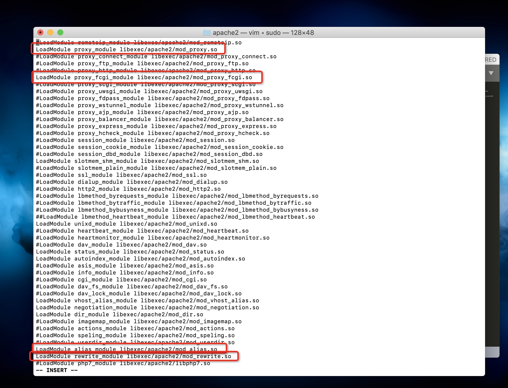
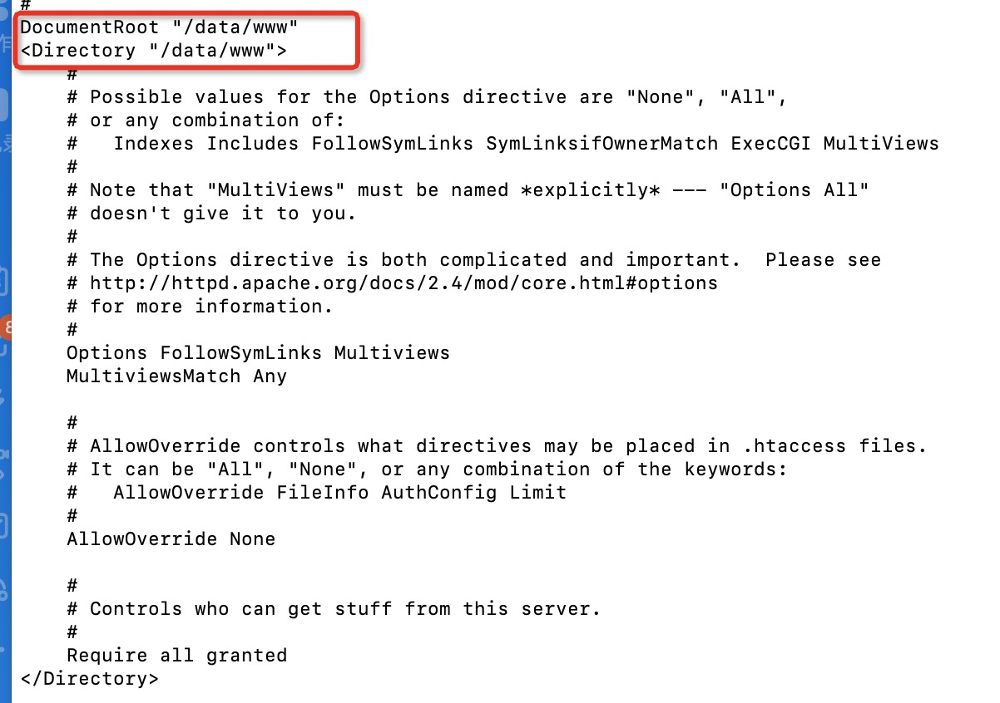
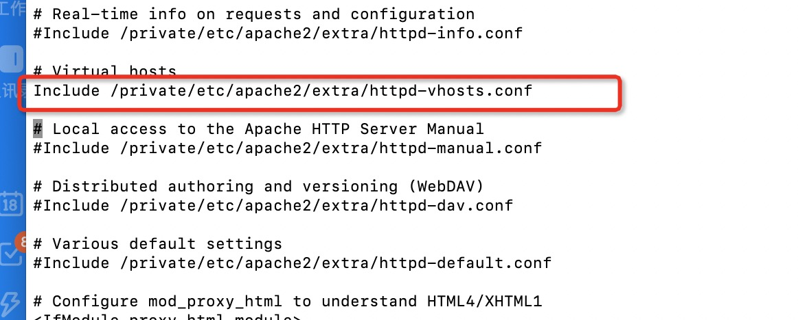
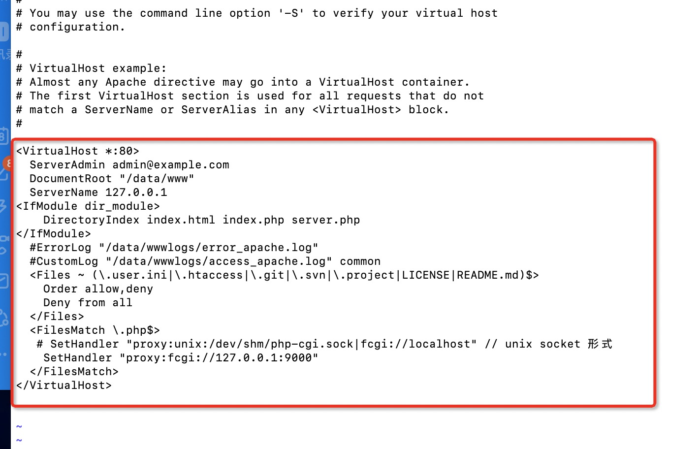
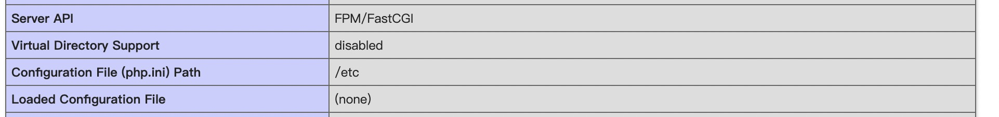

[](https://travis-ci.org/singcl/php_mvc)
[](https://packagist.org/packages/singcl/php_mvc)
[](https://packagist.org/packages/singcl/php_mvc)
[](https://packagist.org/packages/singcl/php_mvc)
[](https://packagist.org/packages/singcl/php_mvc)
[](https://packagist.org/packages/singcl/php_mvc)

1. **unable to bind listening socket for address '/run/php/php7.1-fpm.sock' no such file or directory**

原因：`php-fpm` 没有启动，如下启动：

```bash
# 启动命令：
sudo /etc/init.d/php7-fpm start
```

2. 查看Ubuntu Apache2 服务器日志
```sh
tail -f /var/log/apache2/*.log
```

3. remote-ssh

4. 启动Apache2后打开php 网站报错

```sh
sudo apache2 start
```
```
Service Unavailable
The server is temporarily unable to service your request due to maintenance downtime or capacity problems. Please try again later.
```

有可能是php-fpm没有启动
```bash
sudo /etc/init.d/php7.3-fpm start
```

5. MYSQL
```sh
# 启动mysql
sudo service mysql start 
```
一直报错
```
-su: 30: export: : bad variable name
```
最终问题定位： 在`/etc/profile` 之前添加了如下语句
```sh
SET NODE_HOME=/opt/node10.16.0-linux-x64
PATH = $PAHT:NODE_HOME
```
删除上面自己添加的即可启动


6. WSL 暂不支持 netstat  ss 等命令

7. 
```sh
# 查看MYSQL数据库中所有用户
mysql> SELECT DISTINCT CONCAT('User: ''',user,'''@''',host,''';') AS query FROM mysql.user;

# 查看数据库中具体某个用户的权限
mysql> select * from mysql.user where user='singcl' \G    

#查看user表结构　需要具体的项可结合表结构来查询
mysql> desc mysql.user;
```

8. 数据库操作相关问题
```bash
ERROR 1698 (28000): Access denied for user 'root'@'localhost'
# 创建新的管理员账户
https://stackoverflow.com/questions/39281594/error-1698-28000-access-denied-for-user-rootlocalhost

#
# 将新创建的管理员账号设置为密码链接
ERROR 1698 (28000): Access denied for user 'root'@'localhost' (using password: NO)
https://www.jianshu.com/p/2b63c65caf6a
```


## 启动
```sh
# 1 启动apache2
sudo service apache2 start

# 2 启动php-fpm
sudo service php7.3-fpm start

# 3 启动mysql
sudo service mysql start
```

9. PDO 相关问题

```sh
# 环境：Ubuntu 16.02
```

代码中使用PDO 时候返回 `PDOException: can not find driver`。 然后我们查看`phpinfo()` 确认下： PDO 显示：`drivers no value`

说明PDO 链接MYSQL 驱动找不到。

网上搜索这个问题，答案都是挺多的， 赞成数最多的方案：
```sh
# @see https://stackoverflow.com/questions/32728860/php-7-rc3-how-to-install-missing-mysql-pdo

# 第一步安装
apt-get install php7.3-mysql

#第二步 激活

# phpenmod@see https://tecadmin.net/enable-disable-php-modules-ubuntu/
phpenmod pdo_mysql

ln: failed to create symbolic link '/etc/php/7.3/cli/conf.d/20-pdo_mysql.ini': Permission denied
rm: cannot remove '/var/lib/php/modules/7.3/cli/disabled_by_admin/pdo_mysql': Permission denied

# 可以看出来这一步会在/etc/php/7.3/cli/conf.d/ 中创建一个符号链接 到/etc/php/7.3/mods-abailable/pdo_mysql.so
# 同时创建 /var/lib/php/modules/7.3/cli/enabled_by_admin/pdo_mysql

# 权限不够sudo
sudo phpenmod pdo_mysql
# 第三步 重启
sudo service apache2 restart
```

然后不幸的是还是失败了！！

我观察`/etc/php/7.3`中的目录 发现有个fpm。  fpm 和 cli 目录下都有php.ini 文件？

**我的PHP 使用的是 apache2 fast-cgi php-fpm 方式启动的，那么配置完三个步骤我只是重启了apache， php-fpm 是不是也要重启？**

```sh
sudo service php7.3-fpm restart
```

OK!! 成功了。

10. Mysql 链接不上

`ERROR 1698 (28000): Access denied for user 'root'@'localhost'`

@see https://stackoverflow.com/questions/39281594/error-1698-28000-access-denied-for-user-rootlocalhost

11. `php -r 'phpinfo();' | grep 'mysql'`

## 调试

xdebug 安装文档 https://xdebug.org/docs/install#compile

vscode xdebug 文档 https://marketplace.visualstudio.com/items?itemName=felixfbecker.php-debug

#### pecl安装php扩展
Pecl全称The PHP Extension Community Library，php社区扩展库，由社区编写，维护。

使用pecl方便之处在于我们不用到处找源码包下载编译，配置，不用手动phpize,configure,make,make install,自动识别模块安装路径，

我们只需要编辑php.ini配置文件开启扩展，当然我们也需要自己配置一些参数的时候可以先下载源码再构建

https://www.cnblogs.com/hk-faith/p/8777289.html

## Composer

1. php composer.phar update 时候warning: `Failed to download phpunit/phpunit-mock-objects from dist: The zip extension and unzip command are both missing, skipping.`

解决：没有安装zip导致的。 `sudo apt-get install zip`

## Page 相关页面
```sh
loacalhost               # 增删改查数据库         
loacalhost/canvas        # canvas画布相关示例
loacalhost/scratch       # 刮刮卡示例
```


## Apache2 php7.3 php7.3-fpm

1. 初始化配置
```sh
sudo apt-get install software-properties-common
sudo add-apt-repository -y ppa:ondrej/php
sudo apt-get update
```

2. 安装主要package
```sh
# https://www.zhaokeli.com/article/8496.html
sudo apt-get install apache2 php7.3 php7.3-fpm php7.3-mysql mysql-server
```

3. **配置apache2**（关键步骤）
``` sh
# https://blog.csdn.net/KBellX/article/details/78980317
# https://blog.csdn.net/margin_0px/article/details/82801045

# 配置apache 使用php-fpm fcgi
sudo ln -s /etc/apache2/mods-available/proxy.conf /etc/apache2/mods-enabled/proxy.conf
sudo ln -s /etc/apache2/mods-available/proxy.load /etc/apache2/mods-enabled/proxy.load
sudo ln -s /etc/apache2/mods-available/proxy_fcgi.load /etc/apache2/mods-enabled/proxy_fcgi.load
sudo ln -s /etc/apache2/mods-available/rewrite.load /etc/apache2/mods-enabled/rewrite.load

# 配置 2 /etc/apache2/sites-enabled/000.default.conf
1 <VirtualHost *:80>
  2         # The ServerName directive sets the request scheme, hostname and port that
  3         # the server uses to identify itself. This is used when creating
  4         # redirection URLs. In the context of virtual hosts, the ServerName
  5         # specifies what hostname must appear in the request's Host: header to
  6         # match this virtual host. For the default virtual host (this file) this
  7         # value is not decisive as it is used as a last resort host regardless.
  8         # However, you must set it for any further virtual host explicitly.
  9         ServerName mv.hongde.com
 10         ServerAdmin webmaster@localhost
 11         DocumentRoot /home/singcl/php_mvc
 12
 13         # Available loglevels: trace8, ..., trace1, debug, info, notice, warn,
 14         # error, crit, alert, emerg.
 15         # It is also possible to configure the loglevel for particular
 16         # modules, e.g.
 17         #LogLevel info ssl:warn
 18        <Directory /home/singcl/php_mvc>
 19             Options +FollowSymlinks
 20             AllowOverride All
 21             Require all granted
 22        </Directory>
 23
 24        <FilesMatch \.php$>
 25             SetHandler "proxy:unix:/var/run/php/php7.3-fpm.sock|fcgi://localhost/"
 26        </FilesMatch>
 27         ErrorLog ${APACHE_LOG_DIR}/error.log
 28         CustomLog ${APACHE_LOG_DIR}/access.log combined
 29
 30         # For most configuration files from conf-available/, which are
 31         # enabled or disabled at a global level, it is possible to
 32         # include a line for only one particular virtual host. For example the
 33         # following line enables the CGI configuration for this host only
 34         # after it has been globally disabled with "a2disconf".
 35         #Include conf-available/serve-cgi-bin.conf
 36 </VirtualHost>
```

4. 启动

```sh
# 1 启动apache2
sudo service apache2 start

# 2 启动php-fpm
sudo service php7.3-fpm start

# 3 启动mysql
sudo service mysql start
```

## MYSQL
```sh
# root 用户登录
sudo mysql -u root -p;
```
```sh
# 新建用户
create user 'singcl'@'localhost' indentified by 'singcl';
```
```sh
# 新建数据库
create database project;
```
```sh
# 授权用户singcl@localhost 拥有数据库project 的所有权;
# https://blog.csdn.net/lindiwo/article/details/81708166
grant all privileges on project.* to singcl@localhost identified by 'singcl';
# 刷新
flush privileges;
```
```sh
# 切换用户
mysql -u singcl -p;

# 在 SQL 中新建一个 project 数据库（上面已经完成），增加一个item 表、并插入两条记录，命令如下：
#CREATE DATABASE `project` DEFAULT CHARACTER SET utf8 COLLATE utf8_general_ci;
USE `project`;

CREATE TABLE `item` (
    `id` int(11) NOT NULL auto_increment,
    `item_name` varchar(255) NOT NULL,
    PRIMARY KEY (`id`)
) ENGINE=InnoDB AUTO_INCREMENT=1 DEFAULT CHARSET=utf8;
 
INSERT INTO `item` VALUES(1, 'Hello World.');
INSERT INTO `item` VALUES(2, 'Lets go!');
```

@Refer: https://www.awaimai.com/128.html#51

# MAC 使用系统自带的Apache和PHP-FPM 开启Apache+PHP-FPM服务

1. copy一份配置文件
```shell
cd /etc/cd /etc/apache2/
sudo cp httpd.conf.bak httpd.conf
```

2. 打开配置文件编辑
```sh
sudo vim httpd.conf
```
解开相关依赖模块注释，如图


3. 配置web服务器目录



4. 解开虚拟主机路径


5. 配置vhost
```sh
sudo vim extra/httpd-vhosts.conf
```
如图：


好了，现在配置已经完成。在/data/www下建一个文件：
```sh
touch index.php
```
```php
<?php
  phpinfo();
````
OK, 访问localhost：


大功告成！